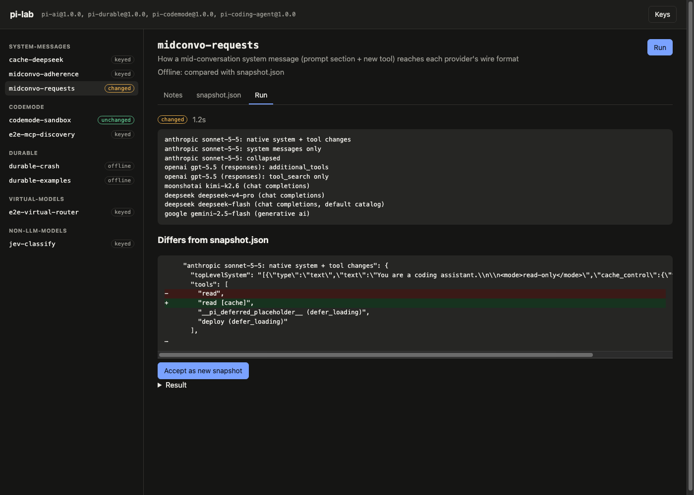

# pi-lab

Reproducible experiments that show how [pi](https://github.com/earendil-works/pi) works inside, and that track what changes from one release to the next.

Started with pi 1.0 (October 2026): codemode and MCP, deferred tool loading, mid-conversation system messages, virtual models, non-LLM models (Jev), and the experimental pi-durable harness. Each experiment pairs runnable code with notes that explain the mechanism and link to pi's source.

## Experiments

| Experiment | Feature | Needs | What it shows |
|---|---|---|---|
| [codemode-sandbox](experiments/codemode-sandbox/NOTES.md) | codemode | – | QuickJS-in-a-worker sandbox: call bridging, `store()`, error hints, timeout and memory limits, the missing-`await` gap |
| [midconvo-requests](experiments/midconvo-requests/NOTES.md) | system messages | – | One mid-conversation prompt/tool change as Anthropic, OpenAI, Kimi, DeepSeek, and Gemini request bodies |
| [durable-crash](experiments/durable-crash/NOTES.md) | pi-durable | – | Kill the process mid tool call: `replay: "safe"` vs default, memos, when partial output survives |
| [durable-examples](experiments/durable-examples/NOTES.md) | pi-durable | – | Official examples as a baseline: busy inbox (steer/follow-up), background subagents on SQLite, compaction |
| [cache-deepseek](experiments/cache-deepseek/NOTES.md) | system messages | DeepSeek | Measured cache hits: in place 96%, collapsed 42%, tool list resent 48% |
| [midconvo-adherence](experiments/midconvo-adherence/NOTES.md) | system messages | DeepSeek | Whether models obey an instruction that arrives mid-conversation |
| [jev-classify](experiments/jev-classify/NOTES.md) | non-LLM models | TypeSafe | Typed classifier answers with probabilities, about 250 ms per call |
| [e2e-mcp-discovery](experiments/e2e-mcp-discovery/NOTES.md) | codemode, tool_search | DeepSeek | Real pi + a local MCP server: how models find hidden MCP tools, and what it costs |
| [e2e-virtual-router](experiments/e2e-virtual-router/NOTES.md) | virtual models | DeepSeek, TypeSafe | A router that plans on v4-pro (picked by Jev) and implements on flash |

## Run

Node 22.18 or newer (TypeScript runs natively).

```bash
npm ci --ignore-scripts
npm run exp -- list              # experiments and the keys they need
npm run exp -- --offline         # all key-free experiments, compared with their snapshots
npm run exp -- codemode-sandbox  # one experiment
cp .env.example .env             # add keys for the others
npm run exp -- --all
```

`PI_LAB_VERBOSE=1` streams each experiment's log. Experiments call real APIs only when their keys are set; a full keyed run costs a few cents.

## Local UI

```bash
npm run ui
```

Open the printed `http://127.0.0.1:4173/#token=…` URL. The UI lists the experiments by feature, renders their notes, shows their source (`run.ts` plus the fixtures and helpers listed under `related` in `meta.json`, highlighted), runs them with a live log, shows the diff when a key-free result no longer matches its snapshot (with a button to accept it), and lets you enter API keys.



It is built for your own machine only:

- It listens on `127.0.0.1` and rejects requests whose `Host` header is not that address (DNS rebinding).
- Every API call needs the random token printed at startup, so other web pages you have open cannot start runs or spend credits. The token travels in the URL fragment, which browsers never send to servers.
- Keys entered in the UI stay in server memory unless you choose to save them to `.env`; values are never sent back to the page. Only keys that an experiment declares can be set.

## How tracking works

pi packages are pinned to exact versions in `package.json`.

- **Key-free experiments are deterministic.** Their result is stored in `snapshot.json`; the runner fails when a result differs and prints a diff. `--update` accepts the new result.
- **Every day**, [`track.yml`](.github/workflows/track.yml) checks npm for a newer `@earendil-works/pi-ai`. If there is one, it upgrades all pi packages, reruns the key-free experiments with `--update`, and opens a pull request whose body is the report: which experiments changed, with diffs, and which failed. A failing experiment is a signal too: pi-durable and parts of codemode are experimental and change without notice.
- **Experiments that call models** vary between runs. They write `last-run.json` (with the pi versions used) and are rerun by hand.

Already waiting on pi's main branch at the time of writing: Anthropic mid-conversation tools defined inline (`b271b0a52`), which should change the first rows of the [midconvo-requests](experiments/midconvo-requests/snapshot.json) snapshot.

## Layout

```
experiments/<name>/
  meta.json        title, feature, required keys, related files shown in the UI
  run.ts           prints one JSON result to stdout, logs to stderr
  NOTES.md         question, findings, mechanism, source links
  snapshot.json    key-free experiments: the expected result
  last-run.json    keyed experiments: the latest recorded result
fixtures/          shop MCP server, virtual-model router extension
lib/               experiment helpers, running the pi CLI in an isolated config dir
runner/            the experiment runner (core.ts, shared with the UI) and its diff
ui/                local web UI: server.ts (node:http) and index.html (no build step)
```

Keys stay in `.env` (git-ignored). Nothing here is meant to be hosted: experiments spawn processes, run MCP servers, and kill themselves on purpose.

## License

MIT. `experiments/durable-examples/examples/` are copied from pi v1.0.0 (MIT, Copyright (c) Earendil Works) with imports changed to the published packages.
